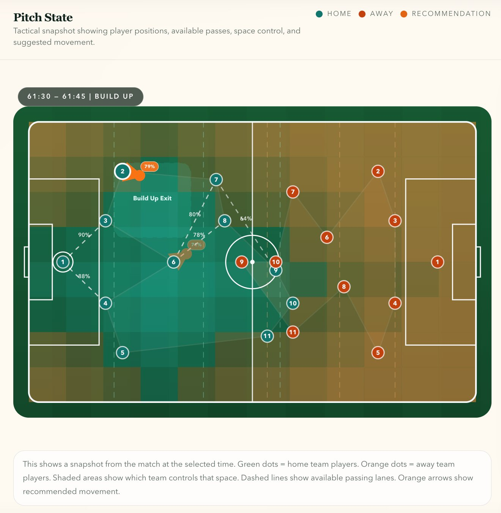
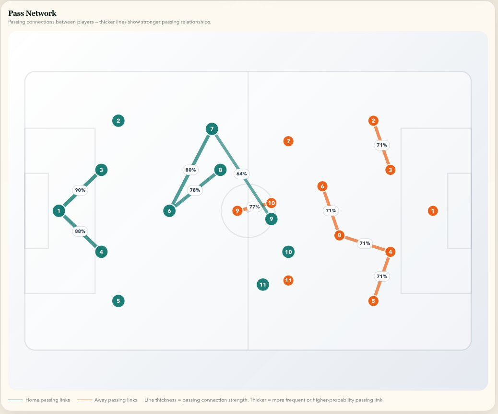
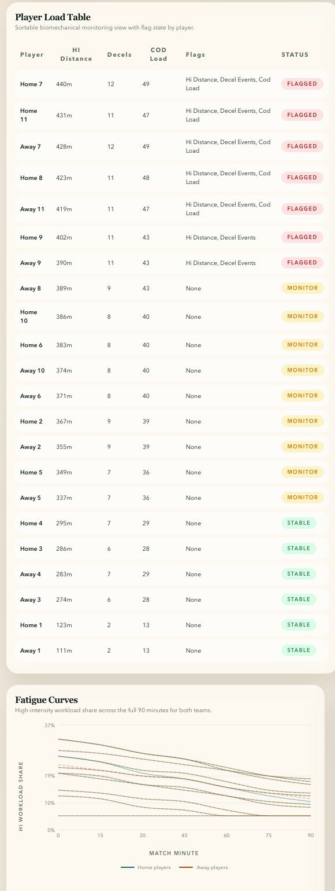
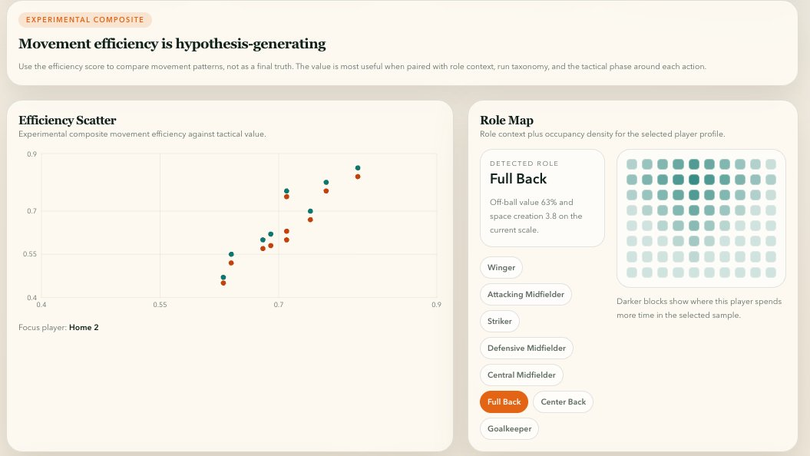

## Soccer Physics Engine

**[Live Dashboard](https://soccer-physics-engine.vercel.app)** · **[User Guide](USER_GUIDE.md)** · **[API Docs](#api-endpoints)**

A decision-support tool for soccer analysts, coaches, and performance staff. Takes player tracking data and produces tactical analysis, physical load monitoring, and player movement intelligence.



*Tactical snapshot from a build-up phase — showing pitch control zones, passing lanes with probabilities, and a movement recommendation.*

## What it does

### Tactical analysis

Analyzes match sequences to surface tactical patterns and recommend movement improvements.

- Phase-of-play detection (build-up, pressing, transitions, chance creation)
- Pitch control and passing lane computation
- Movement recommendations with predicted improvement and plain-English explanations
- Pressing intensity, effectiveness, and counter-press speed
- Team shape: compactness, width, depth, formation detection

### Physical load monitoring

Tracks biomechanical load proxies from movement data to support monitoring conversations.

- High-intensity distance, deceleration events, change-of-direction load
- Within-match fatigue curves (sprint speed degradation over time)
- Left/right asymmetry detection
- Load flags relative to within-match baselines
- Note: these are monitoring proxies, not injury predictions

### Player movement intelligence

Identifies which players create value through movement, not just ball touches.

- Off-ball run classification (overlap, diagonal, stretching, dropping, support)
- Space creation attribution (which run pulled which defender)
- Movement efficiency: tactical value relative to biomechanical cost (experimental metric)
- Role detection from movement patterns

## Architecture

```text
Tracking Data (Metrica CSV, 25fps)
│
▼
┌─────────────────┐
│  Kloppy Loader   │  Data ingestion + validation
└────────┬─────────┘
│
▼
┌─────────────────┐
│  Physics Engine   │  Kinematics, pitch control, spatial analysis
└────────┬─────────┘
│
┌─────┼──────┬──────────┐
▼     ▼      ▼          ▼
Tactical  Load   Player    Graph
Analysis  Monitor Intel    Model
│     │      │          │
└─────┼──────┴──────────┘
│
▼
┌─────────────────┐
│   FastAPI + ML    │  State scoring, recommendations
└────────┬─────────┘
│
▼
┌─────────────────┐
│     Docker        │  Containerized service
└────────┬─────────┘
│
┌─────┴──────┐
▼            ▼
AWS ECS      Vercel
(API)      (Dashboard)
```

## Screenshots


*Match Analysis — pitch state with tactical overlays*


*Pass Network — passing connections for both teams with probability labels*


*Load Monitor — biomechanical load table and fatigue curves*


*Player Intelligence — efficiency scatter and role detection*

## Quick start

### Run locally with sample data

```bash
git clone https://github.com/deepakdeo/soccer-physics-engine.git
cd soccer-physics-engine
uv sync
uv run uvicorn src.api.main:app --reload
```

### Run the dashboard

```bash
cd frontend
npm install
npm run dev
# Open http://localhost:5173
```

### Use the API directly

```bash
curl -X POST http://localhost:8000/analyze-sequence \
  -H "Content-Type: application/json" \
  -d '{"dataset": "metrica", "match_id": "sample_game_1", "start_time_s": 60.0, "end_time_s": 65.0, "focus_team": "home"}'
```

### Use with your own tracking data

The system uses Kloppy for data loading, which supports multiple tracking data providers. To use your own data:

1. Add your tracking files to `data/raw/`
2. Create a loader in `src/io/` for your provider's format (or use an existing Kloppy provider)
3. The full pipeline — kinematics, pitch control, graphs, recommendations, load monitoring — runs automatically on any compatible tracking data.

## Input format

The API accepts JSON with:

- `dataset`: which data provider (`"metrica"`)
- `match_id`: which match to analyze
- `start_time_s` / `end_time_s`: time window in seconds
- `focus_team`: `"home"` or `"away"`
- `focus_player_id`: optional, zoom into one player

## Output

The API returns JSON with:

- Tactical state score (0-1) and pitch control percentage
- Phase classification (what tactical phase is happening)
- Movement recommendations with predicted improvement
- Player load profiles with monitoring flags
- Plain-English explanations

## API endpoints

- `POST /analyze-sequence` — tactical analysis + recommendations for a time window
- `POST /match-report` — full match tactical and physical report
- `POST /load-report` — biomechanical load profiles for all players
- `POST /search-sequences` — find similar tactical moments across matches
- `GET /player-profile/{player_id}` — movement intelligence profile
- `GET /health` — service status
- `GET /model-info` — model version and metadata

## Tech stack

| Layer | Technologies |
|-------|-------------|
| Physics engine | Python, NumPy, SciPy |
| ML / Graphs | scikit-learn, PyTorch, NetworkX |
| API | FastAPI, Pydantic, Uvicorn |
| Frontend | React, TypeScript, Tailwind CSS, D3.js |
| Infrastructure | Docker, AWS ECS Fargate, ECR, API Gateway, CloudWatch |
| Quality | pytest (108 tests), ruff, mypy, GitHub Actions CI/CD |

## Data

Built on Metrica Sports open tracking data (2 sample matches, 25fps, 22 players + ball). StatsBomb open event data available for enrichment.

## Documentation

- **[User Guide](USER_GUIDE.md)** — step-by-step walkthrough for coaches and analysts
- **[Build Plan](BUILD_PLAN.md)** — complete technical specification and build phases
- **[Architecture](infra/architecture.md)** — AWS deployment architecture

## Status

v1.0.0 — 42 analytical features, 108 tests passing, deployed on AWS ECS Fargate with React dashboard on Vercel. Built on Metrica Sports open tracking data (2 anonymized matches, 25fps, 22 players + ball). Designed to work with any tracking data provider through the Kloppy abstraction layer.

## Acknowledgments

- [Metrica Sports](https://github.com/metrica-sports/sample-data) for open tracking data
- [StatsBomb](https://github.com/statsbomb/open-data) for open event data
- [Kloppy](https://kloppy.pysport.org/) for standardized data loading
